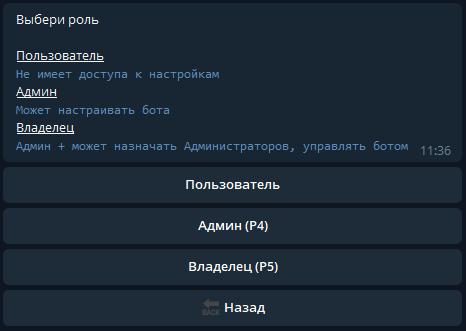

.. The Bot of the Lords documentation master file, created by
   sphinx-quickstart on Thu Apr  8 11:54:36 2021.
   You can adapt this file completely to your liking, but it should at least
   contain the root `toctree` directive.

Администраторы
--------------
В этом разделе вы можете добавить пользователей Telegram, которым хотите дать права для управления ботом. Для этого нужно нажать на кнопку ``➕ Добавить``, после чего бот предложит ввести имя пользователя будущего администратора. 

.. note:: Имя пользователя или username - это не ник. Имя пользователя начинается с собачки(@), найти его можно в профиле пользователя. У аккаунта может и не быть юзернейма, в таком случае для добавления в администраторы бота пользователю сначала нужно будет создать юзернейм.

После добавления нового администратора, бот предложит вам выбрать для него роль. По умолчанию, новый администратор получает роль "**Р4**". Всего доступно 3 роли:

* пользователь
* админ (Р4)
* владелец (Р5)

Подробное описание каждой роли приведено в самом боте. 

       
       Роли пользователей бота

.. note:: Дополнительных владельцев бота тоже можно назначать. Но следует быть осторожным: у владельцев есть право удалять других владельцев и админов. Не назначайте пользователя владельцем, если не доверяете ему.
