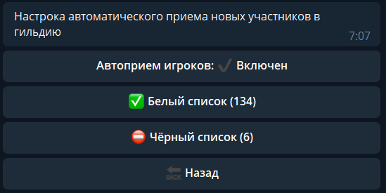
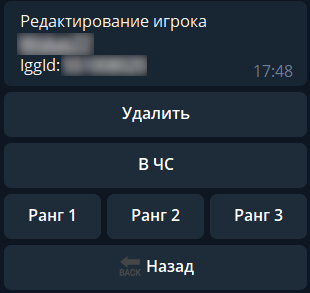

.. The Bot of the Lords documentation master file, created by
   sphinx-quickstart on Thu Apr  8 11:54:36 2021.
   You can adapt this file completely to your liking, but it should at least
   contain the root `toctree` directive.

Автоприем игроков
-----------------
В боте доступна функция автоматического приема и повышения в ранге игроков. 

.. important:: Для работы данной функции аккаунт, к которому привязан бот, должен иметь 4 ранг в гильдии

       Настройка автоприема

Функцию можно включать и отключать по желанию в любое время. 

Чтобы бот принял игрока в гильдию или отклонил его заявку, необходимо сначала сформировать белый и черный списки.

* Игроки из **белого списка** автоматически принимаются в гильдию с назначением ранга
* Заявки от игроков из **черного списка** автоматически отклоняются

Добавление осуществляется с помощью кнопки ``➕ Добавить``. После нажатия кнопки необходимо отправить боту Ник игрока или его IGG ID. 

.. important:: При добавления игрока по нику, он должен находиться в гильдии

.. attention:: Бот чувствителен к регистру. Ник нужно добавлять идентично игровому: с соблюдением строчных и прописных букв, количества пробелов, букв L l и I i.

После добавления в белый список, вы можете выбрать ранг, который следует присвоить этому игроку, либо оставить все как есть (в таком случае игрок останется в R1).

       Редактирование ранга игрока

После добавления в черный список - бот автоматически исключит игрока из гильдии.

При необходимости Вы можете удалять игроков из списков, перемещать из белого в черный и назад, менять выдаваемый при приеме ранг.

.. note:: При смене ника настройки бота не меняются, так как для приема/отклонения заявки бот использует IGG ID аккаунта. Ники внутри черного и белого списков автоматически обновляются раз сутки.