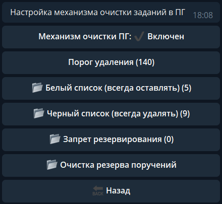
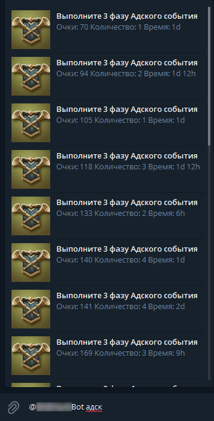
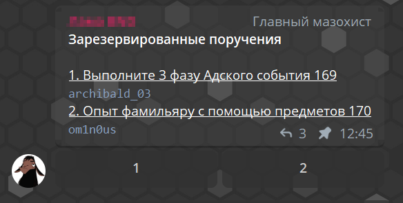
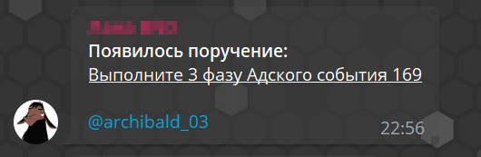

Очистка ПГ
-----------------
Бот обладает гибкой системой очистки доски поручений.

       Меню настройки "Очистка ПГ"

.. important:: Для работы данной функции аккаунт, к которому привязан бот, должен иметь 4 ранг в гильдии

Минимальная настрока очистки ПГ - выбор порога удаления. Для этого нужно нажать на кнопку с соответствующим названием и ввести нужное число. На скрине выше - это 140. Соответственно бот будет удалять **ВСЕ** поручения дешевле 140 очков. При наличии заданий менее 140 очков, которые вы не хотите удалять - можно их добавить в белый список. Для этого необходимо нажать на кнопку ``Белый список`` => ``➕ Добавить`` и выбрать нужное поручение с количеством очков. Таким же образом можно настроить удаление ненужных поручений выше 140 очков. Только в таком случае вместо белого списка выбираем **черный**. 

Механизм очистки ПГ можно включать и выключать в любое время через соответствующую кнопку.

Резервирование поручений
~~~~~~~~~~~~~~~~~~~~~~~~
Зачастую во время ПГ возникают ситуации, когда конкретному игроку нужно конкретное непопулярное задание, которое обычно удаляется. Например - потерять убитыми войска 4 класса или занять топ 10 в одиночных событиях. В обычных условиях, чтобы оставить такое поручение, нужно делать рассылку, убедиться, что все Р4 ее прочли и приняли к сведению, а потом сидеть и мониторить доску на предмет появления этого поручения. При включенном механизме очистки ПГ это все сводится к минимуму - достаточно в специально выделенном для этого чате зарезервировать нужное поручение и все. При его появлении бот не будет удалять это поручение и отправит вам сообщение в Telegram, что оно появилось и висит на доске. 

Для включения возможности резервирования поручений необходимо зарегистрировать телеграм чат с типом **ПГ** (:ref:`chat-registraion-label`).

Непосредственно резервирование происходит следующим образом:

#. Игрок вводит в чате Telegram-тег бота(это его юзернейм, начинающийся с @). Например: @TBOTL_bot
#. После юзернейма ставится пробел и начинается ввод названия нужного поручения. Например: @TBOTL_bot адск
#. Сверху над полем ввода появится список поручений, с указанием очков, количества и времени на каждое поручение. Достаточно просто выбрать нужное.

       Резервирование поручений

4. После того, как игрок нажал на нужное поручение, оно автоматически добавится в список, который закрепляется в чате. 
#. Каждому поручению в списке присваивается кнопка с номером. Если вы хотите зарезервировать такое же поручение, какое уже висит в списке - можно не набирать команду резервирования, а просто нажать на кнопку с номером этого поручения.

       Список зарезервированных поручений

6. После появления зарезервированного поручения в чате появится соответствующее сообщение с пингом Telegram-аккаунта, который это поручение резервировал.

       Сообщение о появлении поручения на доске

Очистка резерва поручений
~~~~~~~~~~~~~~~~~~~~~~~~~~~~~~~~~~~~~~~~~~~~~~~~~

Если вы поймали поручение, которое ранее резервировали, и резерв вам больше не нужен - находите в списке нужное поручение и нажимаете кнопку с его номером. Если поручение резервировали только вы - бот удалит его из резервного списка. Если кроме вас еще кто-либо резервировал это поручение, бот удалит из списка ожидающих поручение аккаунтов только вас. 

Администраторы и владельцы бота имеют отдельную возможность редактировать список зарезервированных поручений через Меню бота: ``Очистка ПГ`` => ``Очистка резерва поручений``. 

.. attention:: Когда администратор удаляет какое-то поручение из списка, то оно удаляется для всех, кто его резервировал, а не для определенного игрока.

Запрет резервирования
~~~~~~~~~~~~~~~~~~~~~~~~~~~~~~~~~~~~~~~~~~~~~~~~~

Также предусмотрен запрет резервирования определенных поручений. Если вы не желаете, чтобы какие-то поручения можно было зарезервировать, то можете настроить это через Меню бота: ``Очистка ПГ`` => ``Запрет резервирования``. 