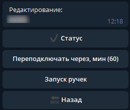

.. The Bot of the Lords documentation master file, created by
   sphinx-quickstart on Thu Apr  8 11:54:36 2021.
   You can adapt this file completely to your liking, but it should at least
   contain the root `toctree` directive.

Управление ботом
================
В боте реализован минимальный функционал для управления ботом на аккаунте.

       
       Управление ботом

Бота можно в любой момент остановить или запустить с помощью кнопки ``Статус``. 
На кнопке отображается текущее состояние бота:

* ``✔`` - бот запущен и работает
* ``❌`` - бот на аккаунте остановлен

При клике на кнопку - бот останавливается, если запущен, и запускается, если остановлен.

.. note:: При входе на аккаунт бот автоматически останавливается

С помощью пункта меню ``Переподключаться через`` можно настроить время, через которое бот будет запускаться, если вы забыли запустить его вручную.

Также на аккаунте можно запустить ручки. Подробнее о необходимых условиях для работы данной функции можно ознакомиться в разделе :ref:`run-hands-label`.