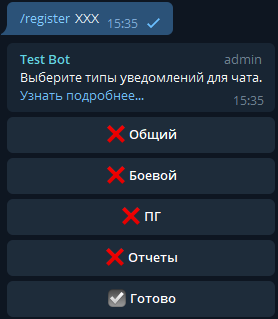

.. _chat-registraion-label:

Регистрация чатов гильдии
-------------------------
Бот может отправлять определенные уведомления в телеграм чаты гильдии. Чтобы получать сообщения, помимо включения механизма уведомлений, необходимо зарегистрировать чат и выбрать типы уведомлений для него.

Для этого:

#. Pарегистрируйте Телеграм чат (если его нет)
#. Добавьте бота в чат и назначить его администтатором (с возможностью закрепления сообщений).
#. Отправить боту команду: ``/register ХХХ``, где XXX - тег гильдии.
#. Выберите типы уведомлений, которые будут отправляться в текущий чат.
#. Нажмите кнопку ``☑ Готово``, чтобы удалить сообщение с настройками.

       
       Регистрация чата гильдии

Типы уведомлений для чатов:

:Общий: Уведомления об активации бонусов королевства и сборов на бастионы хаоса 5 уровня и выше.

:Боевой: Уведомления о боевых сборах, сборах на согильдийцев и помилованиях пленников королевства.

:ПГ: Уведомления о появлении зарезервированных поручений.

:Отчеты: Отчеты по охоте и результатам прошедших событий.